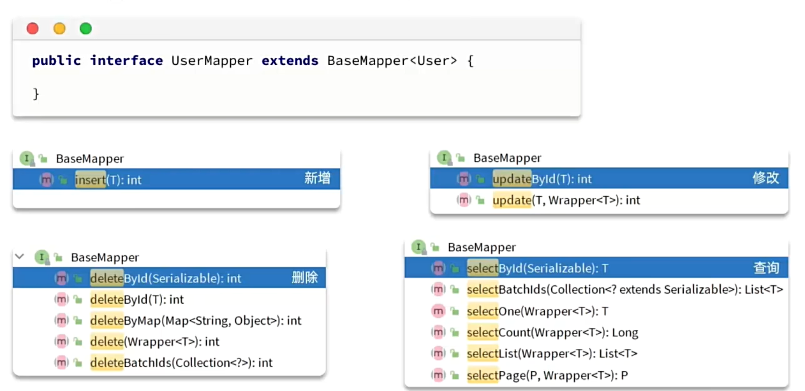
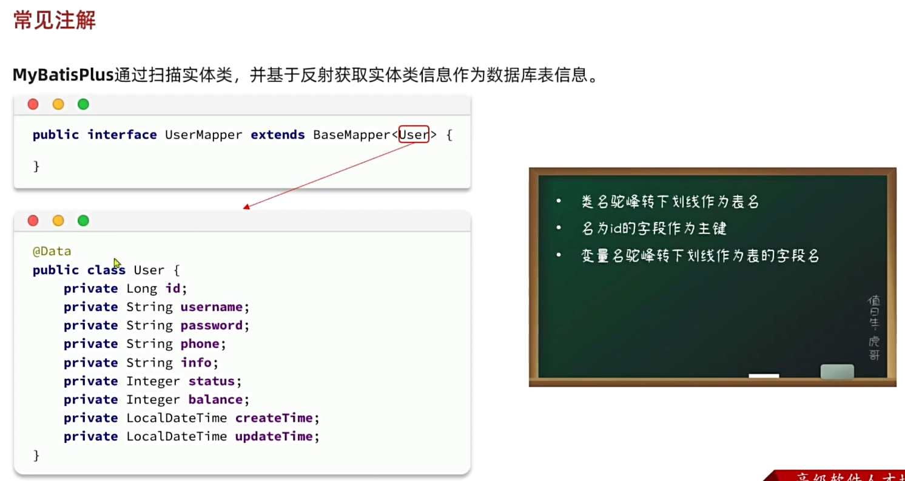
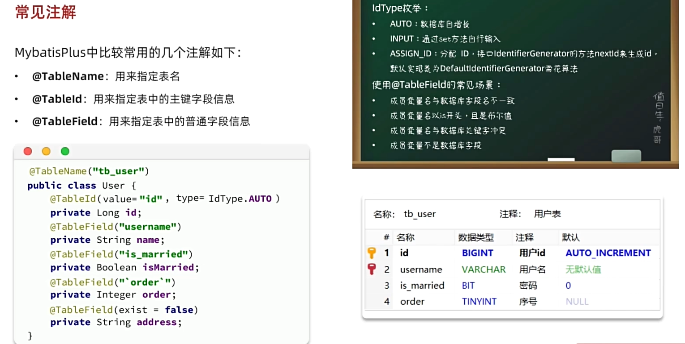
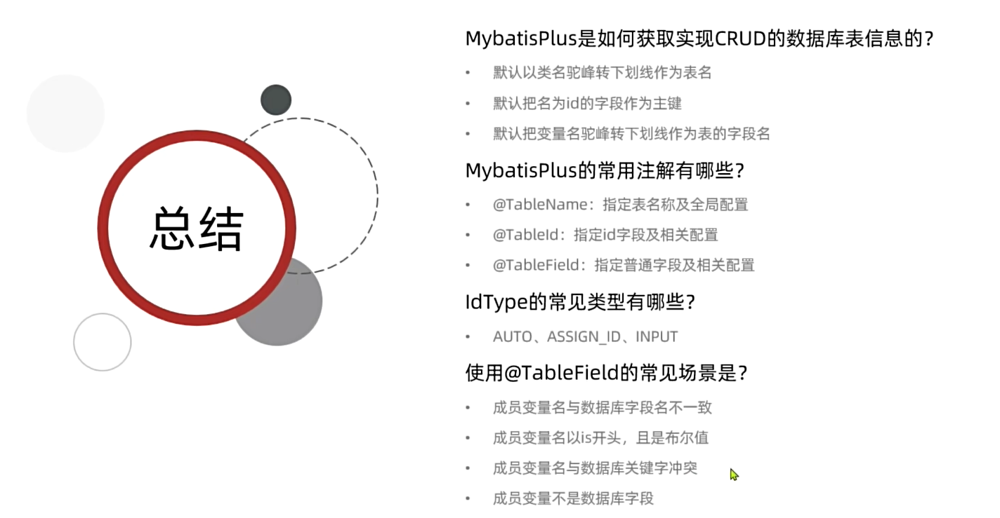

# 如何使用 MybatisPlus
## 1导入依赖
```xml
<!--<dependency>-->
<!--    <groupId>org.mybatis.spring.boot</groupId>-->
<!--    <artifactId>mybatis-spring-boot-starter</artifactId>-->
<!--    <version>2.3.1</version>-->
<!--</dependency>-->
<dependency>
    <groupId>com.baomidou</groupId>
    <artifactId>mybatis-plus-boot-starter</artifactId>
    <version>3.5.3.1</version>
</dependency>
```
## 2 Mapper 接口继承 MyBatisPlus 提供的 BaseMapper 接口
```java
public interface UserMapper extends BaseMapper<User>{
    
}
```


增删改查 CRUD
```java
package com.itheima.mp.mapper;

import com.itheima.mp.domain.po.User;
import org.junit.jupiter.api.Test;
import org.springframework.beans.factory.annotation.Autowired;
import org.springframework.boot.test.context.SpringBootTest;

import java.time.LocalDateTime;
import java.util.List;

@SpringBootTest
class UserMapperTest {

    @Autowired
    private UserMapper userMapper;

    @Test
    void testInsert() {
        User user = new User();
        user.setId(5L);
        user.setUsername("Lucy");
        user.setPassword("123");
        user.setPhone("18688990011");
        user.setBalance(200);
        user.setInfo("{\"age\": 24, \"intro\": \"英文老师\", \"gender\": \"female\"}");
        user.setCreateTime(LocalDateTime.now());
        user.setUpdateTime(LocalDateTime.now());
        userMapper.insert(user);
    }

    @Test
    void testSelectById() {
        User user = userMapper.selectById(5L);
        System.out.println("user = " + user);
    }


    @Test
    void testQueryByIds() {
        List<User> users = userMapper.selectBatchIds(List.of(1L, 2L, 3L, 4L));
        users.forEach(System.out::println);
    }

    @Test
    void testUpdateById() {
        User user = new User();
        user.setId(5L);
        user.setBalance(20000);
        userMapper.updateById(user);
    }

    @Test
    void testDeleteUser() {
        userMapper.deleteById(5L);
    }
}
```

# MyBatisPlus 的原理
MyBatisPlus 通过扫描实体类，并基于反射获取实体类的信息作为数据库表的信息

映射的一些约定 【约定大于配置】


使用注解进行自定义配置

```java
@TableName      指定表名
@TableId        表的主键字段
@TableField     表的普通字段的信息
```
用 @TableField 移出类成员变量但不是数据库表字段


小结


# MyBatisPlus 常见配置 yaml 文件


# MybatisPlus 核心功能