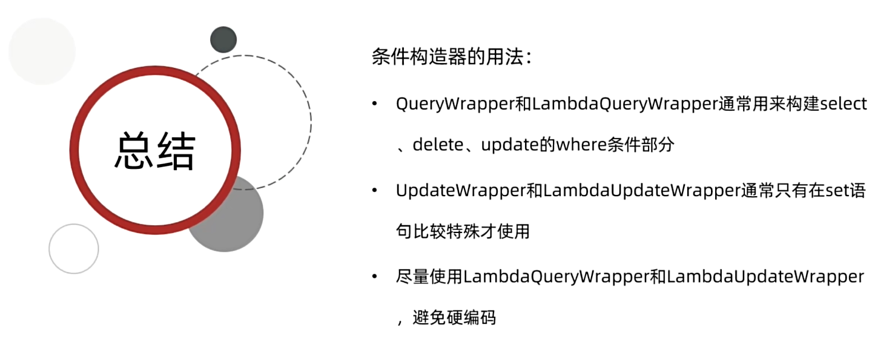
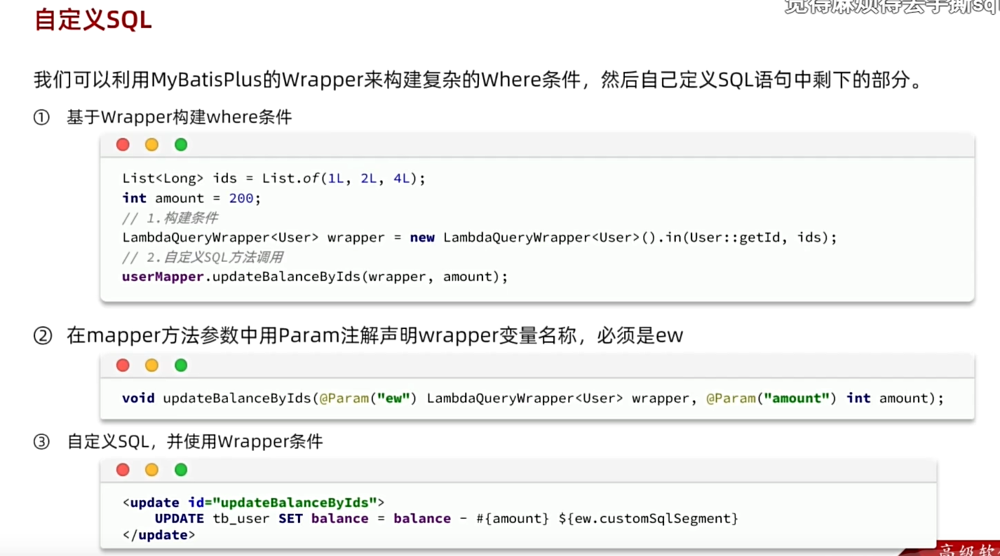
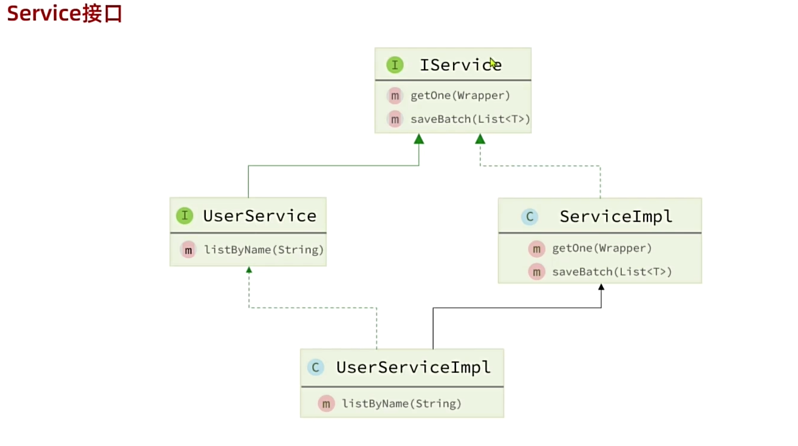
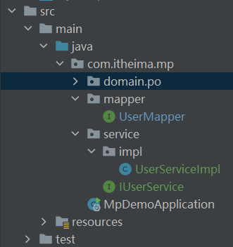
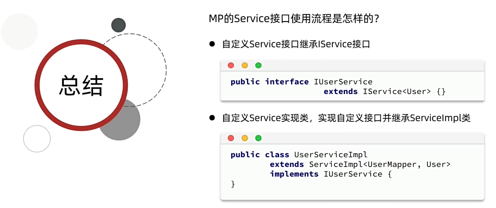
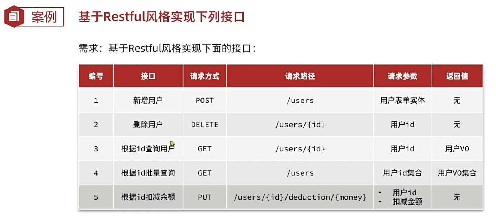

# 如何使用 MybatisPlus
## 1导入依赖
```xml
<!--<dependency>-->
<!--    <groupId>org.mybatis.spring.boot</groupId>-->
<!--    <artifactId>mybatis-spring-boot-starter</artifactId>-->
<!--    <version>2.3.1</version>-->
<!--</dependency>-->
<dependency>
    <groupId>com.baomidou</groupId>
    <artifactId>mybatis-plus-boot-starter</artifactId>
    <version>3.5.3.1</version>
</dependency>
```
## 2 Mapper 接口继承 MyBatisPlus 提供的 BaseMapper 接口
```java
public interface UserMapper extends BaseMapper<User>{
    
}
```


增删改查 CRUD
```java
package com.itheima.mp.mapper;

import com.itheima.mp.domain.po.User;
import org.junit.jupiter.api.Test;
import org.springframework.beans.factory.annotation.Autowired;
import org.springframework.boot.test.context.SpringBootTest;

import java.time.LocalDateTime;
import java.util.List;

@SpringBootTest
class UserMapperTest {

    @Autowired
    private UserMapper userMapper;

    @Test
    void testInsert() {
        User user = new User();
        user.setId(5L);
        user.setUsername("Lucy");
        user.setPassword("123");
        user.setPhone("18688990011");
        user.setBalance(200);
        user.setInfo("{\"age\": 24, \"intro\": \"英文老师\", \"gender\": \"female\"}");
        user.setCreateTime(LocalDateTime.now());
        user.setUpdateTime(LocalDateTime.now());
        userMapper.insert(user);
    }

    @Test
    void testSelectById() {
        User user = userMapper.selectById(5L);
        System.out.println("user = " + user);
    }


    @Test
    void testQueryByIds() {
        List<User> users = userMapper.selectBatchIds(List.of(1L, 2L, 3L, 4L));
        users.forEach(System.out::println);
    }

    @Test
    void testUpdateById() {
        User user = new User();
        user.setId(5L);
        user.setBalance(20000);
        userMapper.updateById(user);
    }

    @Test
    void testDeleteUser() {
        userMapper.deleteById(5L);
    }
}
```

# MyBatisPlus 的原理
MyBatisPlus 通过扫描实体类，并基于反射获取实体类的信息作为数据库表的信息

映射的一些约定 【约定大于配置】


使用注解进行自定义配置

```java
@TableName      指定表名
@TableId        表的主键字段
@TableField     表的普通字段的信息
```
用 @TableField 移出类成员变量但不是数据库表字段


小结


# MyBatisPlus 常见配置 yaml 文件


# MybatisPlus 核心功能
## 条件构造器（使用 SQL 语句的 Where 条件查询）
案例一：
使用 QueryWrapper 查询 名字含有 o 且存款 大于 10000 人的 id username info balance
```java
// 使用 QueryWrapper 进行条件查询
@Test
void testQuerySelectUser() {
    QueryWrapper<User> queryWrapper = new QueryWrapper<User>()
            .select("id", "username", "info", "balance")
            .like("username", "o")
            .ge("balance", 1000);
    List<User> users = userMapper.selectList(queryWrapper);
    users.forEach(System.out::println);
}
```
案例二：
更新名字 为 Jack 用户 余额为 2000
```java
@Test
void testUpdateWrapper() {
    // 1 更新的数据
    User user = new User();
    user.setBalance(2000);
    // 2 更新的条件
    UpdateWrapper<User> updateWrapper = new UpdateWrapper<User>().eq("username", "jack");
    // 3 执行更新
    userMapper.update(user, updateWrapper);
}
```
案例三：使用 UpdateWrapper 更新 id 为 1 2 4 的用户的 balance 减 200
```java
// 案例三 更新多个用户的余额减200
@Test
void testUpdateWrapper2(){
    List<Long> ids = List.of(1L, 2L, 4L);
    UpdateWrapper<User> wrapper = new UpdateWrapper<User>()
            .setSql("balance = balance - 200")
            .in("id", ids);
    userMapper.update(null, wrapper);
}
```

推荐使用 LambdaQueryWrapper 和 LambdaUpdateWrapper
因为可以不使用硬编码
```java
// 推荐使用 Lambda
@Test
void testLambdaQueryWrapper(){
    LambdaQueryWrapper<User> queryWrapper = new LambdaQueryWrapper<User>()
            .select(User::getId, User::getUsername, User::getInfo, User::getBalance)
            .like(User::getUsername, "o")
            .ge(User::getBalance, 1000);
    List<User> users = userMapper.selectList(queryWrapper);
    users.forEach(System.out::println);
}
```
## 小结


## 自定义SQL
核心思想：使用 Wrapper 构建复杂的 where 条件，sql 语句剩余的部分使用原始的 sql 语句



## Service 接口
### 基本用法
实现方法
1 自定义 Service 接口 继承 IService
2 自定义实现类 继承 自定义 Service 接口 和 继承 提供的 ServiceImpl 实现类

目录结构 \

```java
// 自定义接口
package com.itheima.mp.service;

import com.baomidou.mybatisplus.extension.service.IService;
import com.itheima.mp.domain.po.User;

public interface IUserService extends IService<User> {

}
```

```java 
// 实现类
package com.itheima.mp.service.impl;

import com.baomidou.mybatisplus.extension.service.impl.ServiceImpl;
import com.itheima.mp.domain.po.User;
import com.itheima.mp.mapper.UserMapper;
import com.itheima.mp.service.IUserService;
import org.springframework.stereotype.Service;

@Service
public class UserServiceImpl extends ServiceImpl<UserMapper, User> implements IUserService {

}
``` 
```java
// 编写测试类
package com.itheima.mp.service;

import com.itheima.mp.domain.po.User;
import org.junit.jupiter.api.Test;
import org.springframework.beans.factory.annotation.Autowired;
import org.springframework.boot.test.context.SpringBootTest;

import java.time.LocalDateTime;

import static org.junit.jupiter.api.Assertions.*;

@SpringBootTest
class IUserServiceTest {
    @Autowired
    private IUserService userService;

    @Test
    void testSaveUser(){
        User user = new User();
//        user.setId(5L);
        user.setUsername("LiLei");
        user.setPassword("123");
        user.setPhone("19167482537");
        user.setBalance(1222);
        user.setInfo("{\"age\": 24, \"intro\": \"英文老师\", \"gender\": \"female\"}");
        user.setCreateTime(LocalDateTime.now());
        user.setUpdateTime(LocalDateTime.now());

        userService.save(user);
    }
}
```
```java
// 测试查询用户
@Test
void testQueryById(){
    List<User> users = userService.listByIds(List.of(1, 2, 4));
    users.forEach(System.out::println);
}
```



### 案例分析


